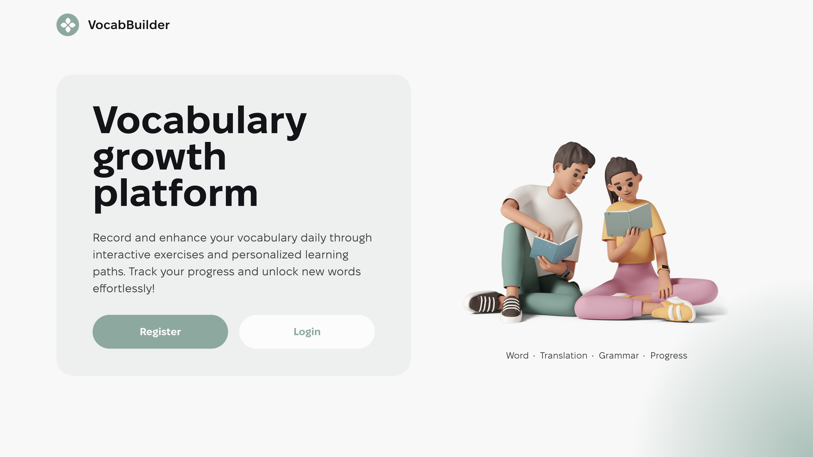
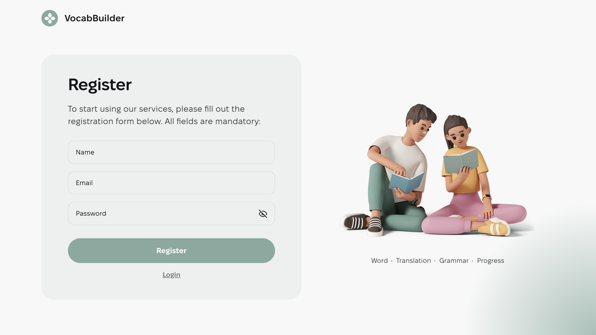
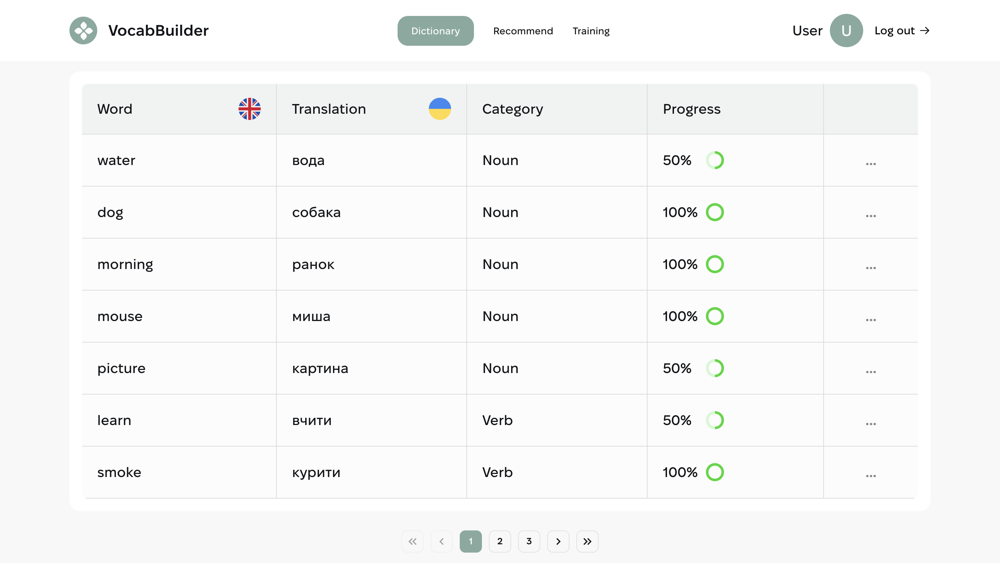
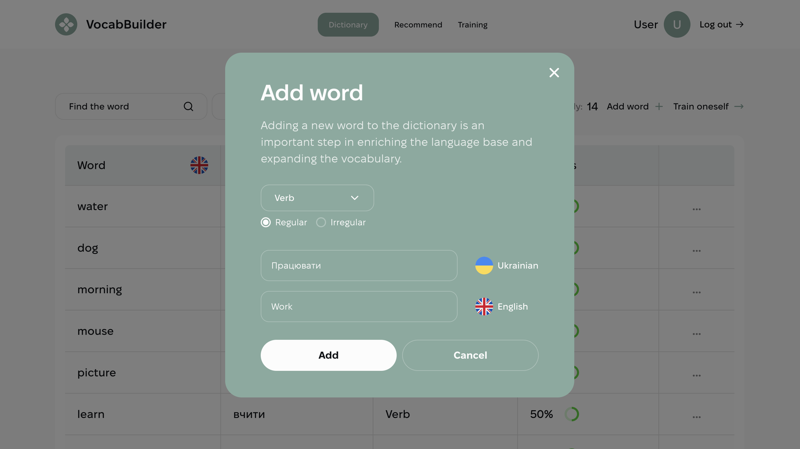
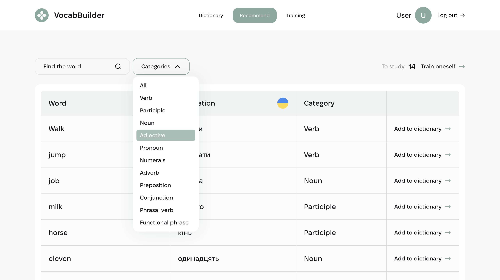
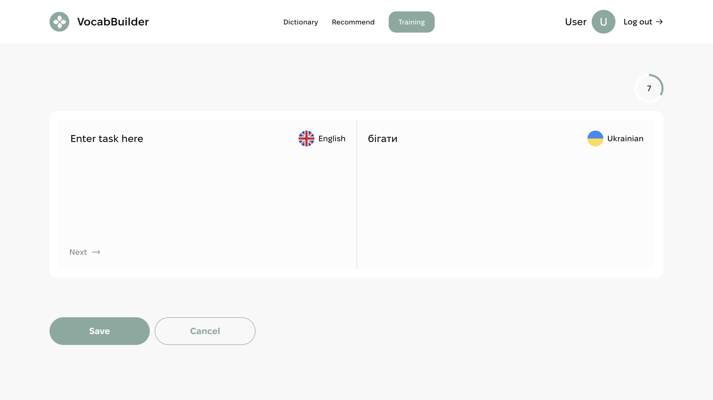
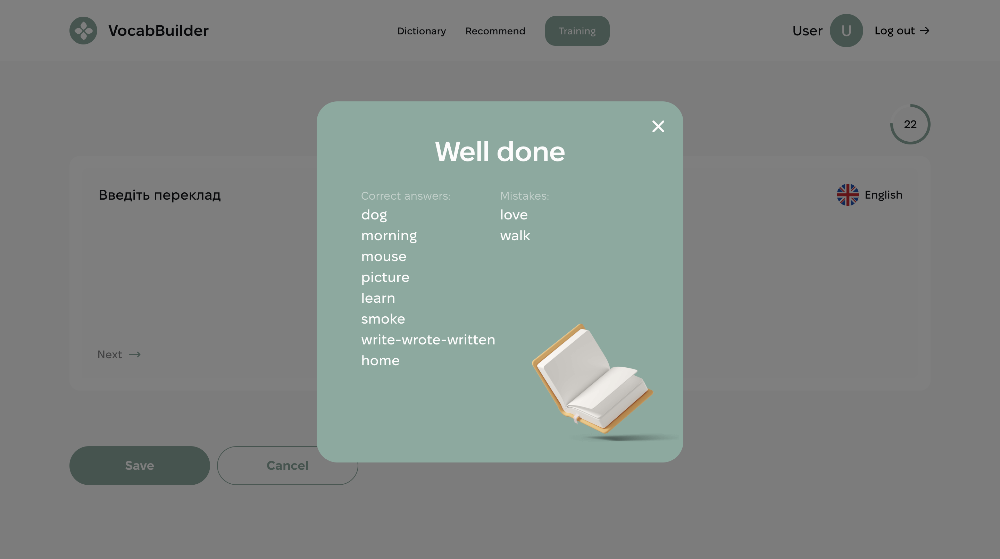

# Vocab Builder

**Live Page** - check out the working version of the project: [Vocab Builder](https://top-vocab-builder.vercel.app/)

## Overview

**Vocab Builder** is an educational platform designed to improve users' vocabulary. It allows users to learn new words, save them to their dictionary, and track progress in language learning.

## Main sections

**Home page**:  
 The main screen where users can start using the platform.



**User registration and login**:  
 Functionality to create an account and sign in.



**User dictionary**:  
 Available only to authorized users, allowing them to store words, view definitions, and track progress in learning them.





**Word search page**:  
 Allows users to search for new words and add them to their dictionary for later learning.



**Word learning page**:  
 Allows users to learn new words and track their results.





## Features

- **Word search**: Users can easily find new words and view their meanings.
- **Favorites list**: Authorized users can add words to a favorites list for later learning.
- **Progress tracking**: The system allows users to view already learned words and track progress.
- **Responsive design**: Optimized for mobile, tablet, and desktop devices (from 320px to 1440px).

## Technologies

**Frontend:**

- React for building the interface
- Redux Toolkit for state management
- React Router for navigation
- Vite for fast development and build
- CSS Modules for styling

## Getting Started

To run the project locally, follow these steps:

1. **Clone the repository:**

   ```bash
   git clone https://github.com/MykhailoVobolis/vocab-builder.git
   ```

2. **Navigate to the project folder:**

   ```bash
   cd vocab-builder
   ```

3. **Install dependencies:**

   ```bash
   npm install
   ```

4. **Run the local server:**
   ```bash
   npm run dev
   ```

Open [http://localhost:5173](http://localhost:5173) in the browser to view the project.

## Materials

- [Live Page](https://top-vocab-builder.vercel.app/) - check out the working version of the project.
- [Technical Specification](https://docs.google.com/spreadsheets/d/15zCxbWA7ubDmFzjmzzXe6ysiHVMd4iD2PcZ7ilN2gRc/edit?gid=1060862504#gid=1060862504) - project details used for development.
- [Project Design](https://www.figma.com/file/XRhVBdCX1wPyzCRA567kud/VocabBuilder?type=design&node-id=0-1&mode=design&t=Aa7GiCvVIpx6Nvi5-0) - interface design used to create the project.
- [Backend](https://vocab-builder-backend.p.goit.global/api-docs/) - provides a REST API for managing words, categories, and users, integrating with the database and supporting authorization.
