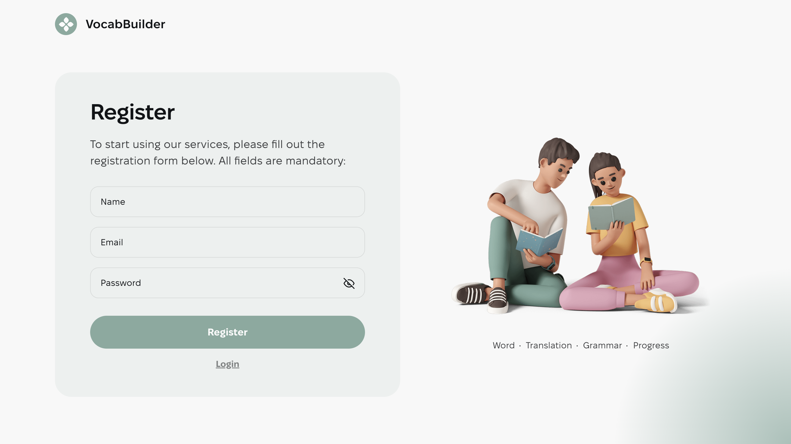
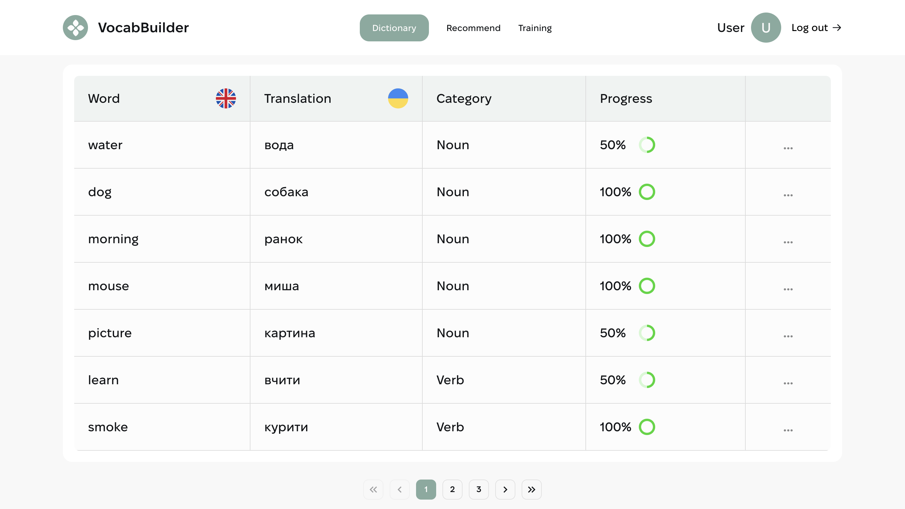
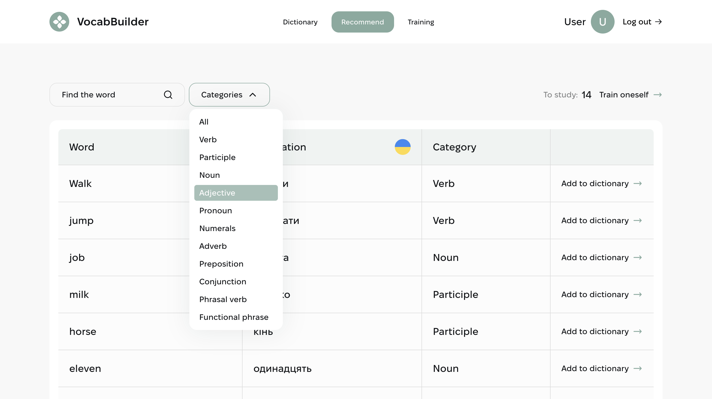

# Vocab Builder

**Live Page** - перегляньте робочу версію проєкту: [Vocab Builder](https://top-vocab-builder.vercel.app/)

## Огляд

**Vocab Builder** — це навчальна платформа, розроблена для покращення словникового запасу користувачів. Вона дозволяє користувачам вивчати нові слова, зберігати їх у словник та відстежувати прогрес у вивченні мови.

## Основні розділи

**Домашня сторінка**:  
 Основний екран, де користувачі можуть розпочати роботу з платформою.


**Реєстрація та авторизація користувачів**:  
 Функціонал для створення акаунту та входу в систему.



**Словник користувача**:  
 Доступний лише для авторизованих користувачів, дозволяє зберігати слова, переглядати визначення та відстежувати прогрес у їх вивченні.




**Сторінка пошуку слів**:  
 Дозволяє користувачам шукати нові слова та додавати їх до свого словника для подальшого вивчення.



**Сторінка вивчення слів**:  
 Дозволяє користувачам вивчати нові слова та відстежувати результати.


## Особливості

- **Пошук слів**: Користувачі можуть легко знайти нові слова та переглянути їх значення.
- **Список улюблених слів**: Авторизовані користувачі можуть додавати слова до списку для подальшого вивчення.
- **Відстеження прогресу**: Система дозволяє переглядати вже вивчені слова та відстежувати прогрес.
- **Адаптивний дизайн**: Оптимізовано для мобільних, планшетів та настільних пристроїв (від 320px до 1440px).

## Технології

**Frontend:**

- React для побудови інтерфейсу
- Redux Toolkit для управління станом
- React Router для навігації
- Vite для швидкої розробки та зборки
- CSS-модулі для стилізації

## Розпочніть роботу

Щоб запустити проєкт локально, виконайте наступні кроки:

1. **Склонуйте репозиторій:**

   ```bash
   git clone https://github.com/MykhailoVobolis/vocab-builder.git
   ```

2. **Перейдіть до папки проєкту:**

   ```bash
   cd vocab-builder
   ```

3. **Встановіть залежності:**

   ```bash
   npm install
   ```

4. **Запустіть локальний сервер:**
   ```bash
   npm run dev
   ```

Відкрийте [http://localhost:5173](http://localhost:5173) у браузері для перегляду.

## Матеріали

- [Жива сторінка](https://top-vocab-builder.vercel.app/) — перегляньте робочу версію проєкту.
- [Технічне завдання](https://docs.google.com/spreadsheets/d/15zCxbWA7ubDmFzjmzzXe6ysiHVMd4iD2PcZ7ilN2gRc/edit?gid=1060862504#gid=1060862504) — деталі проєкту, що використовувались для розробки.
- [Макет до проєкту](https://www.figma.com/file/XRhVBdCX1wPyzCRA567kud/VocabBuilder?type=design&node-id=0-1&mode=design&t=Aa7GiCvVIpx6Nvi5-0) — макет інтерфейсу, використаний для створення проєкту.
- [Backend до проєкту](https://vocab-builder-backend.p.goit.global/api-docs/) — надає REST API для управління словами, категоріями та користувачами, забезпечуючи інтеграцію з базою даних і підтримку авторизації.
